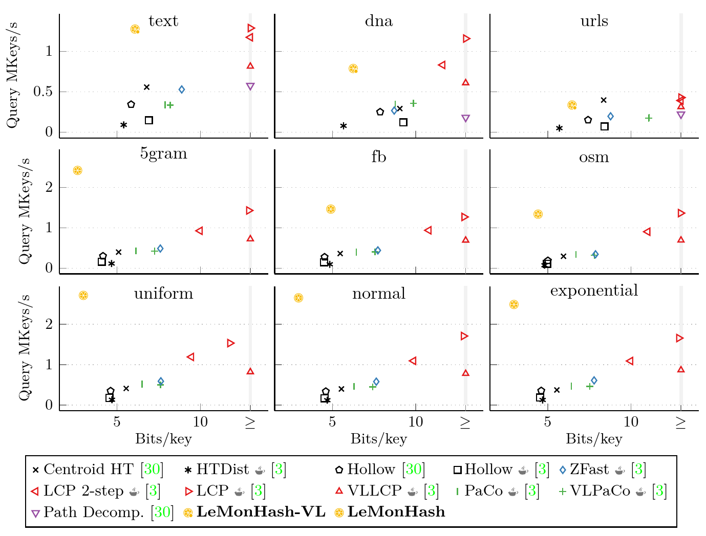

# MMPHF-Experiments

A monotone minimal perfect hash function (MMPHF) maps a set S of n input keys to the first n integers without collisions. At the same time, it respects the natural order of the input universe. In other words, it maps each input key to its rank. MMPHFs have many applications in databases and space-efficient data structures.



The framework provides a unified interface to test basically all modern MPHF constructions that are currently available, including:

- LeMonHash / LeMonHash-VL ([Paper](https://doi.org/10.4230/LIPIcs.ESA.2023.46), [Code](https://github.com/ByteHamster/LeMonHash))
- Path Decomposed Trie ([Paper](https://doi.org/10.1145/2656332), [Code](https://github.com/ot/path_decomposed_tries))
- Longest Common Prefix Bucketing with 2-step MWHC ([Paper](https://doi.org/10.1145/1963190.2025378), [Code](https://github.com/vigna/Sux4J))
- Longest Common Prefix Bucketing ([Paper](https://doi.org/10.1145/1963190.2025378), [Code](https://github.com/vigna/Sux4J))
- Variable Length Longest Common Prefix Bucketing ([Paper](https://doi.org/10.1145/1963190.2025378), [Code](https://github.com/vigna/Sux4J))
- Partial Compacted Trie ([Paper](https://doi.org/10.1145/1963190.2025378), [Code](https://github.com/vigna/Sux4J))
- Variable Length Partial Compacted Trie ([Paper](https://doi.org/10.1145/1963190.2025378), [Code](https://github.com/vigna/Sux4J))
- Centroid Hollow Trie ([Paper](https://doi.org/10.1145/2656332), [Code](https://github.com/ot/path_decomposed_tries))
- Hollow Trie Distributor ([Paper](https://doi.org/10.1145/1963190.2025378), [Code](https://github.com/vigna/Sux4J))
- Hollow Trie (Java) ([Paper](https://doi.org/10.1145/1963190.2025378), [Code](https://github.com/vigna/Sux4J))
- Hollow Trie (C++) ([Paper](https://doi.org/10.1145/2656332), [Code](https://github.com/ot/path_decomposed_tries))
- ZFast Trie ([Paper](https://doi.org/10.1145/1963190.2025378), [Code](https://github.com/vigna/Sux4J))


## Reproducing Experiments

This repository contains the source code and our reproducibility artifacts for comparing different MMPHF constructions.
While we recommend running the evaluation directly, we also provide an easy to use Docker image to quickly reproduce our results.
Alternatively, you can look at the `Dockerfile` to see all libraries, tools, and commands necessary to compile and run the experiments directly.

#### Cloning the Repository

This repository contains submodules.
To clone the repository including submodules, use the following command.

```
git clone --recursive https://github.com/ByteHamster/MMPHF-Experiments.git
```

#### Building the Docker Image

Run the following command to build the Docker image.
Building the image takes about 10 minutes, as some packages (including LaTeX for the plots) have to be installed.

```bash
docker build -t mmphf_experiments --no-cache .
```

Some compiler warnings (red) are expected when building dependencies and will not prevent building the image or running the experiments.
Please ignore them!

#### Running the Experiments
Due to the long total running time of all experiments in our paper, we provide a run script for a highly simplified version of the experiments.
Most importantly, we use a small, synthetic dataset (also due to licensing and download size).

You can modify the benchmark scripts in `scripts/dockerVolume` if you want to change any parameters.
This does not require the Docker image to recompile.
The experiments can be started by using the following command:

```bash
docker run --interactive --tty -v "$(pwd)/scripts/dockerVolume:/opt/dockerVolume" mmphf_experiments <filename>
```

Several experiments files are available:

| Input Distribution | Launch command                           |
|:-------------------| :--------------------------------------- |
| Normal             | /opt/dockerVolume/normal-distribution.sh |

The resulting plots can be found in `scripts/dockerVolume` and have the file extension `.pdf`.

#### Competitors

This fork adds the Rust-based `LcpMmphf` from [sux-rs](https://github.com/vigna/sux-rs) to the comparison.
The Rust benchmark code is in the `rust/` directory and is built automatically by the Docker image.

### License

The benchmark code is licensed under the [GPLv3](/LICENSE).
The competitors (in the `cpp/extlib`, `java/extlib`, and `rust/` directories) are licensed with their respective licenses.
